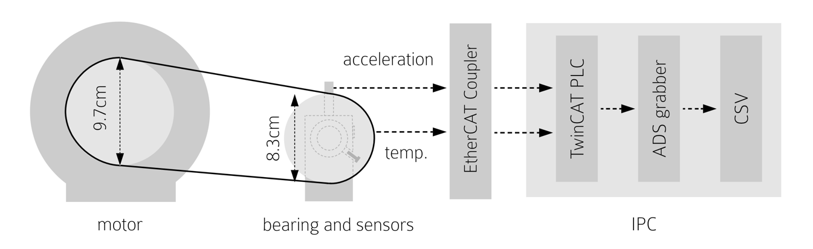
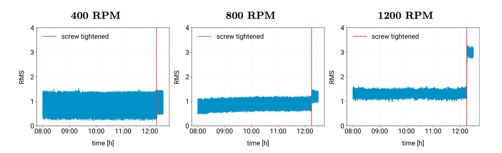
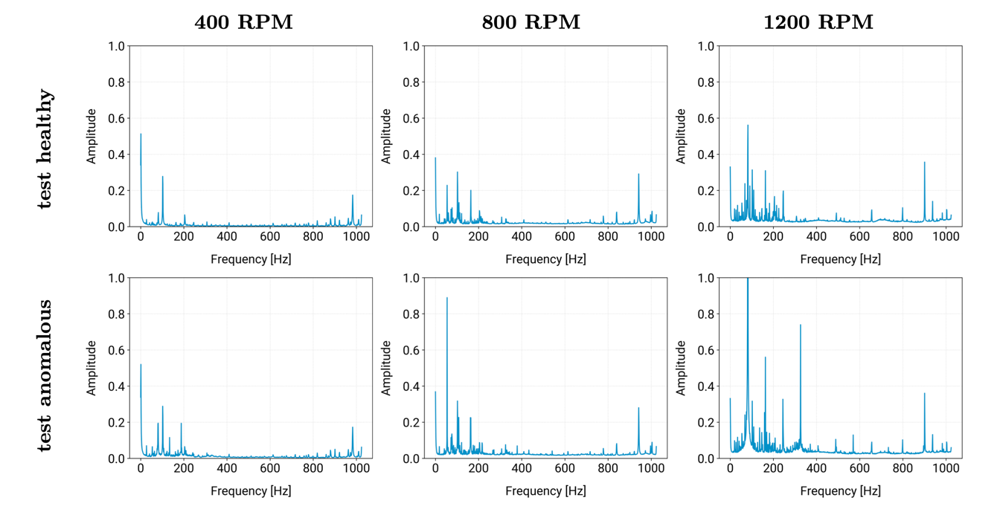

# a2e-data repository

This repository contains several data sets collected with a test machine setup 
consisting of a motor, a bearing, a screw to put pressure onto the bearing and a temperature and acceleration sensor.

This repository requires [git-lfs](https://git-lfs.github.com/) to be installed.

## Insights

## Setup



## RMS



## Frequency Spectrum



## Development

### Setup virtualenv

```
pip install virtualenv;
python -m virtualenv env;
source env/bin/activate;
```

### Install dependencies

```
pip install -r requirements.txt;
pip install -e .;
```

## Usage

### Clean

Used to clip a data set to a specified time frame as well as shifting data points.
The transformed data set is written to `out/cleaner/`.

```
a2e_data/clean.py --config=./data/400rpm.clean.yaml --clip=True --shift="2020-08-26T10:00:00+00:00";
```

### Explore

Used to explore different aspects of a data set. You first have to gunzip the desired dataset.
The plots and stats are written to `out/explorer/`.

```
gunzip -c data/400rpm.csv.gz > data/400rpm.csv;
a2e_data/explore.py --config=./data/400rpm.yaml;
```
